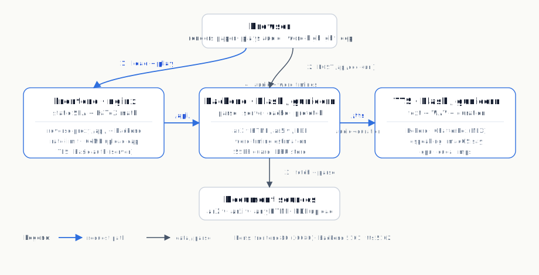

<div align="center">

# 📖 Paper Reader

**Listen to any scientific paper — sentence by sentence, with live word-by-word highlighting.**

Paste an arXiv link, any article URL, or open a local PDF. Paper Reader parses the
document, converts inline LaTeX math to spoken English, synthesises natural neural
speech, and highlights the spoken sentence (light yellow) and the **currently spoken
word** (dark yellow) in real time.

[](https://reader.dzim.site)
[](LICENSE)
[](https://www.python.org/)
[](https://react.dev/)
[](https://flask.palletsprojects.com/)
[](reader_app/deploy/k8s/)
[](https://huggingface.co/hexgrad/Kokoro-82M)

</div>

---

## ✨ Features

- **Reads anything** — arXiv `abs` / `pdf` / `html` links (auto-resolved to the parsed
  HTML version, with ar5iv and PDF fallbacks), any HTML article, or a locally
  uploaded PDF.
- **Word-level highlighting** — the spoken sentence is highlighted in light yellow and
  the currently spoken word in dark yellow, synced to the audio via per-word timings.
- **Math you can hear** — inline `$\LaTeX$` is rendered with [KaTeX](https://katex.org)
  on screen and expanded to spoken English (`mathtex2text.py`) for the audio, so
  equations are read out intelligibly instead of as raw markup.
- **Neural voices** — ships with the open [Kokoro-82M](https://huggingface.co/hexgrad/Kokoro-82M)
  TTS model (12 bundled voice packs) and supports [Chatterbox](https://github.com/aaditya-learning/chatterbox)
  via Apple MLX. `espeak-ng` and the macOS `say` engine are built in as zero-dependency
  fallbacks.
- **Smart PDF parsing** — layout-aware extraction with [pymupdf4llm](https://pypi.org/project/pymupdf4llm/)
  (real headings from font sizes, multi-column text, images at their true positions,
  automatic OCR of scanned pages via Tesseract), with a plain `pypdf` heuristic
  fallback.
- **Background prefetch** — audio for upcoming sentences is generated ahead of time and
  cached, so playback stays seamless.
- **Production-ready deployment** — containerised with Docker, orchestrated with
  Kubernetes (minikube / k3s), with nginx rate-limiting, TLS via Traefik +
  cert-manager (Let's Encrypt), and a realtime **native-TTS mode** for Apple Silicon.
- **Two frontends** — a static no-build SPA (the deployable one, with KaTeX and
  word highlighting) and a classic Vite + React SPA (sentence highlighting).
- **Hardened** — SSRF protection on URL fetching, path-traversal guards, upload /
  download size caps, LRU document-store eviction, and dropped container
  privileges.

## 🎬 Demo

A live instance is running at **[reader.dzim.site](https://reader.dzim.site)**.

> Drop a screenshot or GIF here (`docs/screenshot.png`) to show the highlighted
> reading view. Until then, try the live demo with e.g.
> `https://arxiv.org/abs/2412.06787`.

## 🏗️ Architecture

Paper Reader is a **three-tier** application (the deployable stack under `reader_app/`):

<p align="center">
  
</p>

```
                 ┌──────────────────────────────────────────────┐
  browser ─────▶ │  Frontend (nginx)   :80 / :30080             │
                 │  static SPA + KaTeX · reverse-proxies /api/   │
                 └───────────────────────│──────────────────────┘
                                         │  /api/doc · /api/doc/<id>/audio/<n>
                                         ▼
                 ┌──────────────────────────────────────────────┐
                 │  Backend (Flask)    :5101                    │
                 │  parse · serve · word-timing · cache · prefetch│
                 └───────────────────────│──────────────────────┘
                                         │  POST /tts  { text }
                                         ▼
                 ┌──────────────────────────────────────────────┐
                 │  TTS (Flask)        :5102                    │
                 │  Kokoro · Chatterbox(MLX) · espeak · say     │
                 └──────────────────────────────────────────────┘
```

**Flow:** the frontend POSTs a URL (or PDF) to the backend, which returns the paper as
structured JSON — blocks of headings / paragraphs / figures, each sentence split into
display words with per-word duration weights (math expanded to spoken English). On
playback the frontend fetches `/api/doc/<id>/audio/<n>`; the backend asks the TTS
service to synthesise the sentence, distributes the returned audio duration over the
words proportionally to their weights, caches the result, and prefetches the next
sentences. The frontend syncs `audio.currentTime` against those word timings in a
`requestAnimationFrame` loop to move the word highlight.

## 📁 Repository Tour

```
paperreader2/
├── README.md
├── LICENSE
│
├── reader_app/                 # ── Modern deployable stack (3-tier, recommended) ──
│   ├── server.py               #   Parsing/serving backend        :5101
│   ├── tts_server.py           #   TTS microservice               :5102
│   ├── parsing.py              #   URL resolution + HTML/PDF parsing
│   ├── mathtex2text.py         #   LaTeX → spoken English (shared with legacy/)
│   ├── requirements.txt        #   Slim deps for backend + TTS
│   ├── bench_tts.py            #   TTS real-time-factor benchmark
│   ├── DEPLOY.md               #   Full deployment guide
│   ├── frontend/               #   Static SPA (no build step, KaTeX)
│   ├── docker/                 #   Dockerfiles
│   │   └── Dockerfile.{backend,tts,frontend,tts.pkg}
│   └── deploy/                 #   Deploy scripts + Kubernetes manifests
│       ├── deploy.sh           #     Local minikube deploy
│       ├── deploy-server.sh    #     Remote k3s deploy (+ TLS + basic auth)
│       ├── run-native-tts.sh   #     Native macOS Kokoro server (realtime)
│       └── k8s/                #     Kubernetes manifests
│
├── kokoro/                     # ── Vendored Kokoro TTS (shared) ──
│   ├── interface.py            #   Python interface (voices, device, sample-rate)
│   ├── kokoro_model.py         #   Model definition
│   ├── istftnet.py  plbert.py  #   iSTFT vocoder + PL-BERT text encoder
│   ├── main.py                 #   Phonemisation + generate_full()
│   ├── config.json
│   ├── voices/*.pt             #   12 bundled voice packs (~6 MB, shipped)
│   └── kokoro-v0_19.pth        #   ⚠ NOT in git — download (see below)
│
├── legacy/                     # ── Classic stack + earlier prototypes (reference only) ──
│   ├── README.md               #   What's here & how to run it
│   ├── requirements.txt        #   Classic-stack Python deps (Flask + MLX)
│   ├── backend.py              #   Classic Flask backend (sentence highlighting)  :5001
│   ├── conver_html.py          #   arXiv-HTML → sentences/figures
│   ├── frontend/               #   Vite + React SPA (sentence highlighting)
│   │   ├── src/{App.jsx,api.js,components/}
│   │   └── vite.config.js
│   ├── dash_test.py            #   Legacy Dash UI
│   ├── dash_remote.py          #   Legacy Dash UI (Coqui TTS variant)
│   ├── chatterbox/interface.py #   Chatterbox TTS via Apple MLX
│   ├── local_tts_interface.py  #   OpenAI-compatible REST TTS client
│   ├── assets/                 #   Dash static assets (custom.css / custom.js)
│   ├── test.py  test_kokoro.py  tts_test.py   # Early TTS/markdown experiments
│   └── (entry points chdir to the repo root so kokoro/ resolves; conver_html.py adds reader_app/ for mathtex2text.py)
│
└── docs/architecture.svg       # Architecture diagram (modern stack)
```

> The repo contains **two stacks**. `reader_app/` is the modern, deployable,
> word-highlighting one (recommended). `legacy/` holds the earlier classic stack
> (`legacy/backend.py` + `legacy/frontend/`, sentence highlighting, in-memory sessions) plus the
> original Dash prototypes and TTS experiments. Both stacks share the `kokoro/` model
> at the repo root and `mathtex2text.py` (which lives in `reader_app/`); legacy entry
> points add the repo root to `sys.path` and `chdir` into it, and `legacy/conver_html.py`
> adds `reader_app/` to the path, so those shared paths resolve.

## ⚡ Quick Start

### Option A — Modern stack (`reader_app/`, recommended)

Two processes: a TTS server and a parsing/serving backend that also serves the frontend.

```bash
# 1) Create an environment and install deps
python -m venv .venv && source .venv/bin/activate
pip install -r reader_app/requirements.txt
# + a TTS engine's deps (see "TTS engines" below), e.g. for Kokoro:
pip install torch phonemizer munch numpy soundfile

# 2) Download the Kokoro model weight (git-ignored, ~320 MB)
#    Place it at kokoro/kokoro-v0_19.pth  (voice packs are already bundled)

# 3) Terminal 1 — TTS backend
python reader_app/tts_server.py          # :5102

# 4) Terminal 2 — parsing/serving backend + frontend
python reader_app/server.py              # :5101
```

Open **http://localhost:5101** and paste e.g. `https://arxiv.org/abs/2412.06787`,
or click **Open PDF** for a local file.

> On macOS with no Kokoro weights installed, the TTS server automatically falls back
> to the built-in `say` engine — so it works with zero extra setup.

### Option B — Classic stack (`legacy/`, reference)

> The classic stack is preserved under `legacy/` for reference. It highlights at the
> sentence level (not word level) and keeps sessions in memory. For new use, prefer
> Option A.

```bash
# 1) Python environment
python -m venv .venv && source .venv/bin/activate
pip install -r legacy/requirements.txt    # includes torch, torchaudio, mlx, ...

# 2) Place kokoro-v0_19.pth inside kokoro/  (voice packs are bundled)

# 3) Backend (auto-chdirs to repo root so kokoro/ resolves; mathtex2text.py is reached via reader_app/)
python legacy/backend.py                   # :5001

# 4) Frontend (separate terminal)
cd legacy/frontend && npm install && npm run dev   # :5173, proxies /api → :5001
```

Open the printed URL (default http://localhost:5173). The legacy Dash UI can be run
with `pip install dash dash-bootstrap-components` then `python legacy/dash_test.py`
(see `legacy/README.md`).

### Option C — Docker / Kubernetes (full deployment)

```bash
cd reader_app
./deploy/deploy.sh                  # minikube, all-in-cluster (TTS as a container)
# or
./deploy/deploy.sh --native-tts     # realtime: TTS runs natively on the macOS host
minikube service frontend -n paperreader
```

See **[reader_app/DEPLOY.md](reader_app/DEPLOY.md)** for the full deployment guide
(remote k3s, TLS via Let's Encrypt, basic auth, etc.).

## 🗣️ TTS Engines

`tts_server.py` auto-detects an engine, or you set `TTS_ENGINE`:

| Engine        | `TTS_ENGINE`  | Requirements                                       | Notes |
|---------------|---------------|----------------------------------------------------|-------|
| **Kokoro**    | `kokoro`      | repo `kokoro/` weights + voices, `torch`, `espeak-ng` | Neural, 24 kHz, 12 voices. Best quality. |
| Kokoro (pkg)  | `kokoro-pkg`  | `kokoro` pip package (pulls weights from HuggingFace) | For hosts without the vendored weights. |
| **Chatterbox**| `chatterbox`  | `mlx`, `mlx-audio` (Apple Silicon only)            | Neural, via MLX. Used by the classic stack. |
| **say**       | `say`         | macOS (built in)                                   | Zero deps; default fallback on macOS. |
| **espeak**    | `espeak`      | `espeak-ng` on `PATH`                              | Tiny, no weights. |

`TTS_VOICE` selects a voice (e.g. `af_sarah` for Kokoro, `Samantha` for `say`).
Playback speed is changed client-side via `audio.playbackRate`, so cached audio stays
valid and word timings scale automatically.

### Performance (Kokoro real-time factor)

| Where Kokoro runs                                  | RTF   | Verdict |
|----------------------------------------------------|-------|---------|
| In-cluster container (Docker Linux VM, Apple Silicon) | ~1.7  | slower than realtime → a pause before each sentence |
| **Natively on the macOS host** (PyTorch + Accelerate) | **~0.21** | ~4.7× realtime → prefetch always stays ahead |

For realtime on Apple Silicon, run the TTS natively and let the cluster reach it via
`./deploy/deploy.sh --native-tts` + `./deploy/run-native-tts.sh`. On a real **CUDA** GPU, install a
CUDA torch build and set `TTS_DEVICE=cuda`. See `reader_app/bench_tts.py` to measure.

## 🔧 Configuration

Key environment variables (all optional):

| Variable             | Default                              | Description |
|----------------------|--------------------------------------|-------------|
| `READER_PORT`        | `5101`                               | Backend port. |
| `TTS_URL`            | `http://localhost:5102`              | TTS service URL (backend → TTS). |
| `TTS_PORT`           | `5102`                               | TTS server port. |
| `TTS_ENGINE`         | `auto`                               | `kokoro` · `kokoro-pkg` · `chatterbox` · `say` · `espeak` · `auto`. |
| `TTS_VOICE`          | `af_sarah` (Kokoro) / `af_heart` (pkg) | Voice name. |
| `TTS_DEVICE`         | `auto` (`cuda` if present else `cpu`) | `cpu` · `cuda` · `mps` · `auto`. |
| `TTS_NUM_THREADS`    | —                                    | Torch thread count. |
| `READER_DATA_DIR`    | `<tmp>/paperreader_docs`             | Shared document/audio/image store. |
| `READER_MAX_DOCS`    | `50`                                 | LRU eviction: max documents on disk. |
| `READER_MAX_STORE_BYTES` | `5 GiB`                          | LRU eviction: max total store size. |

## 🌐 API Reference

### Modern stack (`reader_app/server.py`)

| Method & Path                              | Body / Params                              | Returns |
|--------------------------------------------|--------------------------------------------|---------|
| `POST /api/doc`                            | `{"url": "..."}` **or** multipart `file` (PDF) | Document JSON |
| `GET  /api/doc/<doc_id>`                   | —                                          | Document JSON |
| `GET  /api/doc/<doc_id>/audio/<n>`         | —                                          | `{"audio_b64", "duration", "timings": [{start,end}]}` |
| `GET  /api/doc/<doc_id>/img/<n>`           | —                                          | Image bytes (from a PDF) |
| `GET  /api/health`                         | —                                          | `{"status":"ok", "tts": {...}}` |

**Document JSON shape:**

```jsonc
{
  "doc_id": "a1b2c3d4e5f6",
  "title": "Attention Is All You Need",
  "source": "arxiv-html",        // "arxiv-html" | "html" | "pdf"
  "url": "https://arxiv.org/html/1706.03762v7",
  "num_sentences": 187,
  "blocks": [
    { "type": "heading",  "level": 2, "sentences": [ /* Sentence... */ ] },
    { "type": "paragraph",            "sentences": [ /* Sentence... */ ] },
    { "type": "figure",  "image_url": "...", "sentences": [ /* caption */ ] }
  ]
}
// Sentence: { idx, text, words: [...], weights: [...], spoken: "..." }
```

**TTS service** (`reader_app/tts_server.py`):

| Method & Path    | Body                                    | Returns |
|------------------|-----------------------------------------|---------|
| `POST /tts`      | `{"text": "...", "speed"?, "voice"?}`   | `{"audio_b64", "sample_rate", "duration", "engine"}` |
| `GET  /health`   | —                                       | `{"status":"ok", "engine":"<name>"}` |

### Classic stack (`legacy/backend.py`)

| Method & Path                              | Description |
|--------------------------------------------|-------------|
| `POST /api/session`                        | Start a session: `{"url": "...", "tts_engine": "chatterbox"|"kokoro"}` |
| `GET  /api/session/<id>/state`             | Current reading state + highlighted HTML |
| `POST /api/session/<id>/control`           | `{"action": "play_pause"|"next_sentence"|"prev_sentence"|"next_div"|"prev_div"|"speed_inc"|"speed_dec"}` |
| `GET  /api/session/<id>/audio`             | Sentence audio as a WAV blob (`?div_idx=&sentence_idx=`) |
| `DELETE /api/session/<id>`                 | Stop and clear the session |
| `GET  /api/health`                         | `{"status":"ok", "sessions": N}` |

## 🚀 Deployment

The full guide lives in **[reader_app/DEPLOY.md](reader_app/DEPLOY.md)**. Highlights:

- **Local (minikube):** `./deploy/deploy.sh` builds the three images into minikube's
  Docker daemon and applies the `deploy/k8s/` manifests — no registry required.
- **Realtime on Apple Silicon:** `./deploy/deploy.sh --native-tts` runs Kokoro
  natively on the host (~4.7× realtime) and routes the in-cluster `tts` service to
  it via an `ExternalName` service.
- **Public server (k3s):** `./deploy/deploy-server.sh` installs Docker + k3s, builds
  the images, exposes the frontend on NodePort `30080` behind HTTP basic auth, and
  (with `deploy/k8s/tls-ingress.yaml` + cert-manager — see `reader_app/DEPLOY.md`;
  the ingress manifest is git-ignored since it holds personal domain/email) serves
  HTTPS with an auto-renewing Let's Encrypt cert. Live example:
  **https://reader.dzim.site**.
- **Server runtime:** both services run under **gunicorn** — the backend multi-worker
  (`--workers 3 --threads 4`), the TTS single-worker (one Kokoro model in memory) with
  threads. State lives on a shared filesystem so all workers see the same documents /
  audio / images.

## 🛡️ Security & Hardening

- **SSRF protection** — URL fetching validates every redirect hop and refuses
  loopback / private / link-local (incl. cloud metadata `169.254.169.254`) addresses.
- **Path-traversal guard** — document IDs are strictly validated before being used in
  any filesystem path.
- **Size caps** — 64 MB upload limit, 60 MB download cap (defence against zip bombs /
  huge PDFs).
- **Rate limiting** — nginx throttles API and document-load requests per client IP.
- **Least privilege** — containers run as non-root uid 1000 with a read-only root
  filesystem, dropped capabilities, and `seccompProfile: RuntimeDefault`.
- **LRU eviction** — the on-disk document store auto-evicts oldest entries past a
  count / size cap so it can't fill the disk.

## 🧮 How Math Becomes Speech

1. **On screen** — `$...$` and MathML `<math>` (rewritten to `$alttext$`) are rendered
   by KaTeX from a CDN; long equations become centered, horizontally scrollable
   blocks. Without network access it falls back to the raw `$latex$` source.
2. **In audio** — `mathtex2text.py` walks the LaTeX AST
   ([pylatexenc](https://pypi.org/project/pylatexenc/)) and emits spoken English:
   `\sum` → "sum", `\int` → "integral", `\sqrt{x}` → "square root of x", Greek
   letters by name, operators by word, etc. The spoken length feeds each word's
   duration weight so word-highlight timing stays roughly aligned with the audio.

## 🧰 Troubleshooting

| Symptom | Fix |
|---|---|
| **No audio / "audio not available"** | Ensure the TTS server is running on `:5102` and `kokoro-v0_19.pth` is present; check `/api/health` and the TTS `/health`. First synthesis is slow, later sentences are cached. |
| **`espeak-ng` errors (Kokoro)** | On Linux, set `ESPEAK_LIBRARY` to `libespeak-ng.so.1`; on the Docker image it's pinned automatically. macOS users can `export TTS_ENGINE=say` to skip it entirely. |
| **Sentences pause on Apple Silicon** | Kokoro inside the Docker Linux VM is ~7× slower than native (no Apple Accelerate). Use `--native-tts` mode or `TTS_ENGINE=say`. |
| **MPS slower than CPU** | Expected — Kokoro's iSTFT vocoder uses an op MPS lacks; use `TTS_DEVICE=cpu`. A real CUDA GPU does help (`TTS_DEVICE=cuda`). |
| **Scanned PDF gives no text** | Install Tesseract so pymupdf4llm can OCR image-only pages; otherwise the `pypdf` fallback will report it couldn't extract text. |
| **`torch`/`torchaudio` mismatch** | `torchaudio` must match the installed `torch` build (CPU vs CUDA). Reinstall with the correct `--index-url`. |
| **Large `requirements.txt`** | `legacy/requirements.txt` is for the classic stack + MLX; `reader_app/requirements.txt` is the slim modern-stack set. Install the one for the stack you're running. |

## 🤝 Contributing

Issues and pull requests are welcome. To contribute:

1. Open an issue describing the feature or bug (with reproduction steps).
2. Fork the repo and create a branch for your change.
3. Keep shared helpers typed and in the appropriate module
   (`mathtex2text.py`, `reader_app/parsing.py`, etc.).
4. Run the stack locally to confirm nothing regressed:
   ```bash
   python -m compileall legacy/backend.py legacy/conver_html.py reader_app/server.py reader_app/tts_server.py reader_app/parsing.py reader_app/mathtex2text.py
   cd legacy/frontend && npm run lint      # classic-stack frontend
   ```
5. Note any new runtime requirements (GPU deps, external services, model weights).
6. Open a PR with a clear description.

Before publishing derivative work, respect the licences of the bundled models and
libraries (Kokoro, Chatterbox, KaTeX, pymupdf4llm, pylatexenc, etc.).

## 📄 License

Released under the **MIT License** — see [LICENSE](LICENSE).

The bundled voice packs in `kokoro/voices/*.pt` and the Kokoro model code under
`kokoro/` are from the [Kokoro-82M](https://huggingface.co/hexgrad/Kokoro-82M) project
and remain under their respective licences. The large model weight
`kokoro-v0_19.pth` is **not** included in this repository — download it separately.

## 🙏 Acknowledgements

- [Kokoro-82M](https://huggingface.co/hexgrad/Kokoro-82M) — the open neural TTS model.
- [Chatterbox](https://github.com/aaditya-learning/chatterbox) + [mlx-audio](https://github.com/Blaizzy/mlx-audio) — Apple Silicon neural TTS.
- [ar5iv](https://ar5iv.labs.arxiv.org) — arXiv papers as renderable HTML.
- [KaTeX](https://katex.org) — fast math rendering for the web.
- [pymupdf4llm](https://pypi.org/project/pymupdf4llm/) / [PyMuPDF](https://pymupdf.readthedocs.io/) — layout-aware PDF parsing.
- [pylatexenc](https://pypi.org/project/pylatexenc/) — LaTeX → spoken-text conversion.
- [Flask](https://flask.palletsprojects.com/), [Vite](https://vitejs.dev/) + [React](https://react.dev/), [nginx](https://nginx.org/), [Kubernetes](https://kubernetes.io/).
